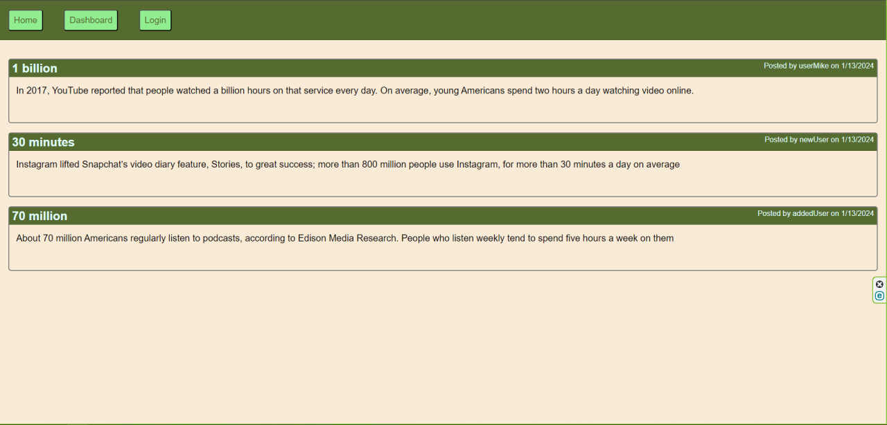

# Dev-Blog
Creating dev-blog web application

## Description

In this project I wanted to created front end app with back end DataBase assigned to it. I wanted to add different functionality for it :
- Storing user information in DB(DataBase) and hashing user password
- Storing data in DB about Posts that user can create and retriving it at home page
- Storing data in DB about Comments that user can add to Posts and retriving it when user visit Post page
- Storing session info about user log in and give him permision to visit Dashboard only when he is loged in
- Adding posibility for user to Add, Update or Delete posts
- Adding posibility for user to Add comments to posts

## Table of Contets

- [Screenshots](#screenshots)
- [Links](#links)

## Screenshots

In this section I provided screenshots of the  Application's functionality.

## Links

In this section I added links to the live application and to the GitHub repositories with the original codebase.

The URL of the live application
    https://dev-blog-4cn0.onrender.com/

GitHub Code Repository:
    https://github.com/MykhailoZakh/Dev-Blog
